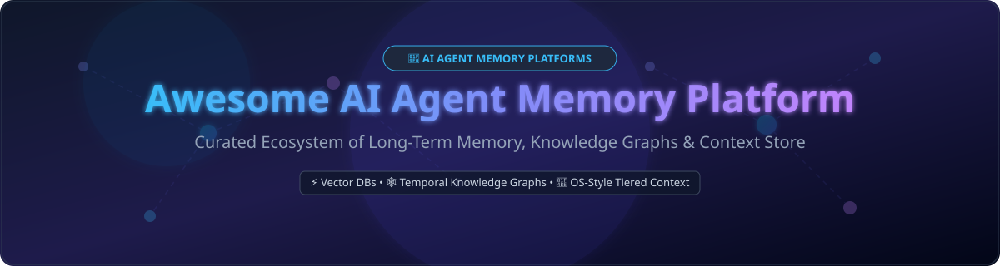

# 🧠 Awesome AI Agent Memory Platform Ecosystem

  

      

---

## ⚡ Top AI Agent Memory Platform Ecosystem & Infrastructure

**Curated List of SaaS Products & Open-Source GitHub Projects**  
*Focused on Long-Term Agent Memory, Temporal Knowledge Graphs, OS-Style Context Management, Vector Memory Layers & Persistent Agent State*  

**Last updated: September 2026** 📅

This repository tracks notable **SaaS platforms** and **open-source projects** for **AI Agent Memory** and long-term context retention. These state-of-the-art memory architectures give autonomous AI agents durable memory beyond standard LLM context windows—extracting entities, tracking fact temporal changes, managing multi-tier working memory, and executing semantic retrieval for complex long-running tasks.

---

## 📑 Table of Contents

- [📈 Market Intelligence & Sector Overview](#-market-intelligence--sector-overview)
- [☁️ SaaS / Hosted Agent Memory Platforms](#️-saas--hosted-agent-memory-platforms)
- [🔓 Open-Source GitHub Projects](#-open-source-github-projects)
- [💡 Memory Framework Selection Guide](#-memory-framework-selection-guide)
- [🤝 How to Contribute](#-how-to-contribute)
- [💖 Support & Sponsorship](#-support--sponsorship)
- [📈 Star History](#-star-history)
- [⚠️ Disclaimer](#️-disclaimer)

---

## 📈 Market Intelligence & Sector Overview

> 📊 **Estimated Market Size & Fragmentation**: The total addressable market (TAM) for AI Agent Memory & Context Infrastructure is estimated at **$2.5 Billion+ (2026)** and is projected to expand rapidly alongside autonomous multi-agent adoption. The sector is currently **moderately fragmented**, with hyper-growth startups (Mem0, Zep, Letta) competing against incumbent vector database hyperscalers (Pinecone, Qdrant, Chroma). However, it exhibits strong **"winner-take-most" network dynamics** driven by standard developer memory primitives, graph extraction quality, and SDK ecosystem integrations.

---

## ☁️ SaaS / Hosted Agent Memory Platforms

Below is a detailed comparison of managed SaaS agent memory and context persistence solutions, sorted in **descending order by company valuation / market size**.

| Product 🚀 | Description 📝 | Company Scale / Valuation 💰 | Starting Pricing Tier 💳 | Free Tier / Trial Limit 🆓 |
| :--- | :--- | :--- | :--- | :--- |
| **[Pinecone](https://www.pinecone.io/)** | High-performance managed vector database serving as long-term memory backend for AI agents. | **$750M Valuation** ($138M Raised) | $50/month (Standard Plan minimum) | **2 GB Storage**, 2M Write Units / 1M Read Units per month |
| **[Qdrant Cloud](https://qdrant.tech/)** | Managed vector search engine with payload filtering optimized for agent memory & context state. | **$200M Valuation** ($87.8M Raised) | ~$25/month (Usage-based Standard cluster) | **1 GB RAM / 4 GB Disk**, 1 Node single cluster forever |
| **[Mem0 Cloud](https://mem0.ai/)** | Drop-in managed memory layer featuring automatic fact extraction, graph memory, and key-value memory. | **$24.5M Raised** (Seed + Series A) | $19/month (Starter Plan) | **10,000 Add Requests**, 1,000 Retrieval Requests per month |
| **[Graphlit](https://www.graphlit.com/)** | API-first knowledge and memory platform for RAG, agent memory ingestion, and automated graph extraction. | **$3.56M Raised** (Seed Round) | $49/month (Hobby Plan + usage) | **100 credits/month**, 1 GB storage & 1,000 content items |
| **[Zep](https://www.getzep.com/)** | Temporal knowledge-graph memory engine designed for AI agents to track fact changes over time. | **~$1M ARR** ($2M Raised / YC W24) | Metered at $1.25 / 1,000 messages + $2.50 / MB | **10,000 credits/month** (2 projects, 1 MCP seat) |
| **[Letta Cloud](https://www.letta.com/)** | Cloud runtime hosting OS-style tiered agent memory (in-context working memory vs. archival storage). | **Venture-Backed** (ex-MemGPT / UC Berkeley lineage) | $20/month (Developer Pro Plan) | **14-Day Free Trial** with 5,000 execution credits |

---

## 🔓 Open-Source GitHub Projects

Leading self-hosted and open-source frameworks for agent memory, temporal knowledge graphs, and persistent state storage. Sorted by **GitHub Stars_Count (descending)**.

-  **[RAGFlow](https://github.com/infiniflow/ragflow)**  
  Open-source RAG engine based on deep document understanding, offering agentic workflow engines and long-term memory context retrieval (Apache 2.0).

-  **[Mem0](https://github.com/mem0ai/mem0)**  
  The leading open-source memory layer for AI agents—drop-in persistent memory with entity extraction, vector/graph support, and personalized agent state management (Apache 2.0).

-  **[CrewAI](https://github.com/crewAIInc/crewAI)**  
  Cutting-edge framework for orchestrating role-playing autonomous AI agents with built-in short-term, long-term, and entity memory systems (MIT).

-  **[Milvus](https://github.com/milvus-io/milvus)**  
  High-performance, open-source cloud-native vector database engineered for scalable neural memory retrieval and billion-scale vector embedding indexing (Apache 2.0).

-  **[Agno (formerly Phidata)](https://github.com/agno-agi/agno)**  
  Lightweight library for building multi-modal agents with structured memory, PostgreSQL session state, and dynamic knowledge retrieval (MIT).

-  **[DSPy](https://github.com/stanfordnlp/dspy)**  
  Framework for programming—rather than prompting—foundation models, featuring declarative memory optimization and automated retrieval compilation (MIT).

-  **[Qdrant](https://github.com/qdrant/qdrant)**  
  High-performance open-source vector search engine and database written in Rust with extended payload filtering for agent state management (Apache 2.0).

-  **[Graphiti (Zep Engine)](https://github.com/getzep/graphiti)**  
  Open-source temporal knowledge graph engine for agent memory—featuring edge validity windows and time-aware fact retrieval (Apache 2.0).

-  **[Cognee](https://github.com/topoteretes/cognee)**  
  Graph-first memory and knowledge indexing pipeline for AI agents—ingest, structure, and query memory with local-first vectors and graphs (Apache 2.0).

-  **[Supermemory](https://github.com/supermemoryai/supermemory)**  
  Open-source second brain and MCP-oriented memory architecture for LLMs, coding agents, and multi-session context persistence (MIT).

-  **[Chroma](https://github.com/chroma-core/chroma)**  
  Open-source AI-native embedding database designed to store agent memories, conversational context, and semantic embeddings locally or on cloud (Apache 2.0).

-  **[Letta (formerly MemGPT)](https://github.com/letta-ai/letta)**  
  Open-source agent framework with OS-inspired tiered memory—allowing agents to self-edit working memory and page long-term memory to disk (Apache 2.0).

-  **[pgvector](https://github.com/pgvector/pgvector)**  
  Open-source vector similarity search for PostgreSQL—the default relational backend for enterprise agent memory and session stores (MIT).

-  **[Weaviate](https://github.com/weaviate/weaviate)**  
  Open-source vector database supporting hybrid search, object storage, and modular machine learning extensions for agent retrieval (BSD-3-Clause).

-  **[LangMem](https://github.com/langchain-ai/langmem)**  
  Open-source SDK by LangChain for adding episodic, semantic, and procedural memory primitives to LangGraph AI agent workflows (MIT).

-  **[Hyperconsciousness](https://github.com/louis030195/hyperconsciousness)** 
  Developer-alpha Rust store for encrypted, append-only agent knowledge, with CLI/MCP access and scoped, expiring grants. Build from source (MIT).

---

## 💡 Memory Framework Selection Guide

| Use Case 🎯 | Recommended Memory Layer 🛠️ | Why? 💡 |
| :--- | :--- | :--- |
| **General Agent Memory** | **Mem0** | Fast, drop-in SDK combining vector + graph + KV storage with automated fact extraction. |
| **Time-Sensitive Facts** | **Graphiti** | Manages validity intervals ("when did fact X change?") using temporal knowledge graphs. |
| **Autonomous Self-Editing** | **Letta** | Implements OS-style memory management where agents invoke tools to edit context. |
| **LangGraph Orchestration** | **LangMem** | Native integration into LangChain/LangGraph agent state loops with memory optimization primitives. |
| **Enterprise Postgres Stack** | **pgvector** | Relational consistency alongside vector search for existing PostgreSQL database setups. |

---

## 🤝 How to Contribute

Contributions are welcome! Follow these steps to submit additions or updates:

1. 🍴 **Fork** the repository.
2. 📝 **Edit** `README.md` to add your platform or open-source tool.
3. 📌 Ensure entries match existing tabular formatting (include exact pricing/stars/description).
4. 🔀 Submit a **Pull Request** with a brief summary of additions.

---

## 💖 Support & Sponsorship

Thank you for exploring and building with the AI Agent Memory ecosystem! If you find this curated list helpful in architecting your AI agents:

- ⭐ **Star** this repository to help others discover it.
- 🔄 **Share** it with fellow AI engineers and builders.
- ☕ **Support the maintainer**: Consider buying me a coffee or sponsoring ongoing development via the [GitHub Sponsor Dashboard](https://github.com/sponsors/ishandutta2007).

---

## 📈 Star History

---

## ⚠️ Disclaimer

- This repository is a **community-curated list** provided for informational and educational purposes.
- **Privacy & Security**: Agent memory platforms retain user conversational history and sensitive state. Enforce encryption, GDPR data deletion compliance, and strict access controls when deploying memory components.
- **Accuracy**: Stale or incorrect memory extractions can lead to agent hallucinations—always evaluate retrieval accuracy on your production workloads.

---

  <b>⭐ Star this repository if you find it helpful for building production AI agents! ⭐</b>

